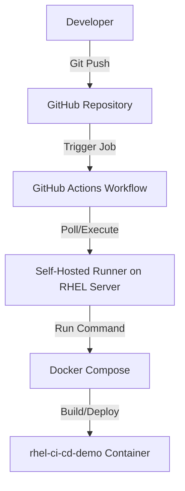

# Automated CI/CD Deployment to RHEL Server

This project demonstrates a high-standard, secure, and fully automated CI/CD pipeline targeting a **Red Hat Enterprise Linux (RHEL)** server (configured for deployment and testing at NIT Trichy). 

Rather than using traditional, complex SSH keys or exposing remote ports, this architecture utilizes a **Self-Hosted GitHub Actions Runner** running inside the host server environment. The runner polls GitHub for changes, builds the Docker image locally, and launches the containerised Node.js Express dashboard seamlessly.

---

## 🏗️ Architecture Overview



### Key Highlights
- **Zero Inbound Port Exposure**: No SSH ports need to be exposed to the public internet for deployment. The self-hosted runner communicates via outbound HTTPS polling.
- **Unified Build & Environment**: Running in Docker ensures that "it works on my machine" translates perfectly to "it works on the RHEL server."
- **Automatic Health Checks**: The pipeline automatically validates that the container is up and running (`docker ps --filter`) after deployment.

---

## 💻 Local Testing Guide (Windows Laptop)

To test the workflow on your local machine before configuring the RHEL server:

### 1. Prerequisites
- Docker Desktop installed and running.
- Git installed.

### 2. Running Locally
Run the app in detatched mode locally to ensure everything works:
```powershell
docker compose up --build -d
```
Access the application at `http://localhost:3000`.

To stop the containers:
```powershell
docker compose down
```

### 3. Setting Up a Local Windows Runner
1. Go to your GitHub Repository -> **Settings** -> **Actions** -> **Runners** -> **New self-hosted runner**.
2. Select **Windows** as the runner OS.
3. Open PowerShell as Administrator, create a directory (e.g., `C:\actions-runner`), and execute the download/configuration commands provided by GitHub.
4. During configuration:
   - Accept the default runner group.
   - Give the runner a descriptive name (e.g., `local-windows-laptop`).
   - Add labels (e.g., `self-hosted`).
5. Run the runner:
   ```powershell
   .\run.cmd
   ```
6. Push a change to the `main` branch to see your local runner pick up the job and run the deployment steps.

---

## 🐧 Red Hat Enterprise Linux (RHEL) Server Guide

Follow these steps to set up the deployment environment on your target RHEL server:

### 1. Install Docker & Docker Compose on RHEL
Ensure Docker and the Docker Compose plugin are installed on the RHEL host.

```bash
# Enable the Docker repository
sudo dnf config-manager --add-repo https://download.docker.com/linux/centos/docker-ce.repo

# Install Docker Engine and Command Line
sudo dnf install docker-ce docker-ce-cli containerd.io docker-compose-plugin -y

# Start and enable Docker daemon
sudo systemctl start docker
sudo systemctl enable docker

# Allow non-root users to execute Docker commands (Optional but recommended for runner)
sudo usermod -aG docker $USER
newgrp docker
```

### 2. Install Self-Hosted GitHub Actions Runner on RHEL
1. Go to your GitHub Repository -> **Settings** -> **Actions** -> **Runners** -> **New self-hosted runner**.
2. Choose **Linux** and select the appropriate architecture (e.g., `x64`).
3. Connect to the RHEL server via SSH and execute the commands listed under **Download** and **Configure**. For example:
   ```bash
   # Create folder
   mkdir actions-runner && cd actions-runner
   
   # Download the latest runner package
   curl -o actions-runner-linux-x64-2.xxx.x.tar.gz -L https://github.com/actions/runner/releases/download/v2.xxx.x/actions-runner-linux-x64-2.xxx.x.tar.gz
   
   # Extract the installer
   tar xzf ./actions-runner-linux-x64-2.xxx.x.tar.gz
   
   # Configure the runner (use the token provided by GitHub settings page)
   ./config.sh --url https://github.com/Kv-Logics/ci-cd-RHEL-testing --token YOUR_TOKEN_HERE
   ```
4. During setup, configure it to run as a systemd service so it persists across reboots:
   ```bash
   sudo ./svc.sh install
   sudo ./svc.sh start
   ```

---

## 🛠️ Management Commands

| Action | Command | Description |
| :--- | :--- | :--- |
| **Start Services** | `docker compose up --build -d` | Build and run containers in the background. |
| **Stop Services** | `docker compose down` | Stop running containers and clean up networks. |
| **View Logs** | `docker compose logs -f` | Tail active application and server console output. |
| **Check Container Status** | `docker ps --filter "name=rhel-ci-cd-demo"` | Confirm container state and port mappings. |
